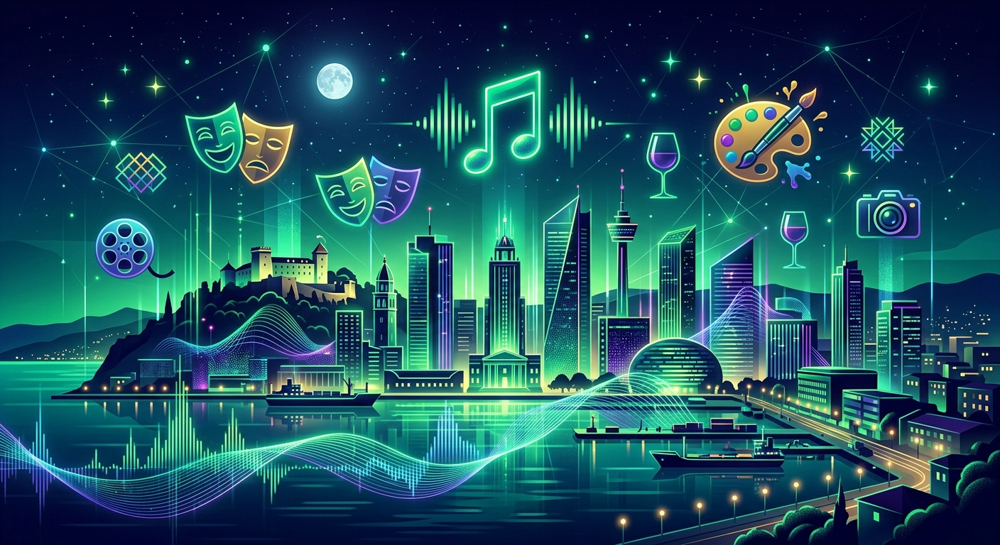

# Riječki Puls 🌊

**Riječki Puls** je napredna AI platforma dizajnirana za centralizirano prikupljanje, strukturiranje i pregled društvenih i kulturnih događanja u gradu Rijeci. Koristeći snagu Google Gemini AI modela, aplikacija rješava problem raspršenosti informacija pretvarajući neorganizirani tekst u pregledan, interaktivan kalendar događanja.

## 💡 Glavne Ideje i Funkcije

### 1. Inteligentna Ekstrakcija Događaja
Aplikacija omogućuje korisnicima da jednostavno zalijepe sirovi tekst s društvenih mreža (poput Reddita ili Facebooka) ili lokalnih portala. AI automatski:
- Prepoznaje naziv događaja, točan datum i vrijeme.
- Identificira lokaciju (Venue) unutar Rijeke.
- Kategorizira događaj (Koncert, Festival, Izložba, Druženje).
- Generira kratak i privlačan opis na hrvatskom jeziku.

### 2. Live Web Search (Google Grounding)
Kroz integraciju s Gemini Live Searchom, "Puls" može samostalno pretraživati internet u potrazi za najnovijim najavama s relevantnih riječkih izvora (Visit Rijeka, MojeKarte, RiRock, Pogon Kulture), osiguravajući da su podaci uvijek svježi i provjereni.

### 3. Bento Grid Dashboard
Dizajnirana prema modernim intuitivnim layoutima, aplikacija koristi "Bento Grid" strukturu za pregledan prikaz kategorija, statusa sustava i istaknutih događanja, prilagođavajući se svim veličinama ekrana.

### 4. Horizontalni Kalendar
Intuitivni selektor datuma omogućuje brzo pretraživanje događanja po danima, pružajući jasan uvid u "puls" grada kroz nadolazeći mjesec.

---

## 🛠️ Tehnološki Stog

- **Frontend:** React (Vite) + Tailwind CSS + Framer Motion
- **Backend:** Node.js (Express)
- **AI Engine:** Google Gemini 1.5 Pro (SDK @google/genai)
- **Search:** Google Search Grounding for real-time information

---

## 🚀 Budući Razvoj (Roadmap)

Aplikacija je zamišljena kao jezgra šireg lokalnog ekosustava:

*   **Povezanost s Mobilnošću:** Integracija s aplikacijama za prijevoz poput **Jadrolinije** (red plovidbe) te taxi službi (**Uber/Bolt**) kako bi korisnici jednim klikom mogli isplanirati put do lokacije događaja.
*   **Suradnja s Energanom:** Planirano je uvezivanje s resursima **Startup inkubatora Energana** i njihovim AI Labom za daljnji razvoj kreativnih tehnologija.
*   **Personalizacija:** Implementacija sustava preporuka baziranih na korisničkim interesima i povijesti posjećenih događanja.
*   **User-Generated Content:** Omogućavanje lokalnim organizatorima da izravno verificiraju i promoviraju svoja događanja.

---

**Razvijeno u Rijeci za Riječane. Grad koji teče.** ⚓
